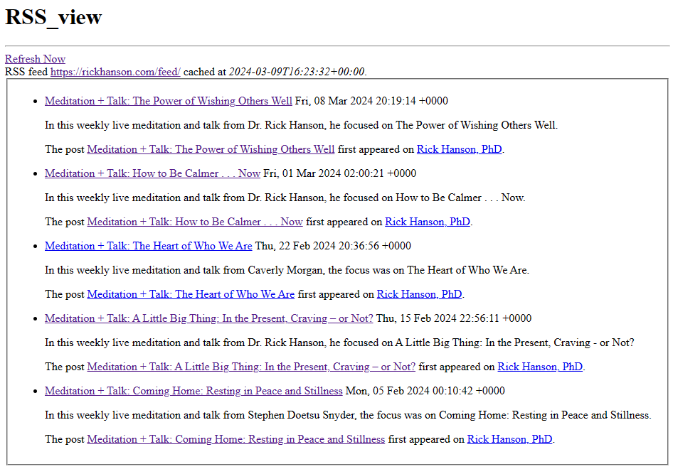

# RSS_View

This is a simple RSS viewer to run on your own web server or locally under Docker.

You can use it to keep up with your favorite podcasts or blogs.

Just change the list of URLs in the config.php file to customize what URLs are fetched by the viewer.

The page's most recent result is cached for 1 hour under the cache/ directory as a simple HTML file. You can link directly to this file if you don't want to run the risk of attempting to refresh an unstable RSS feed.

## Screenshot

